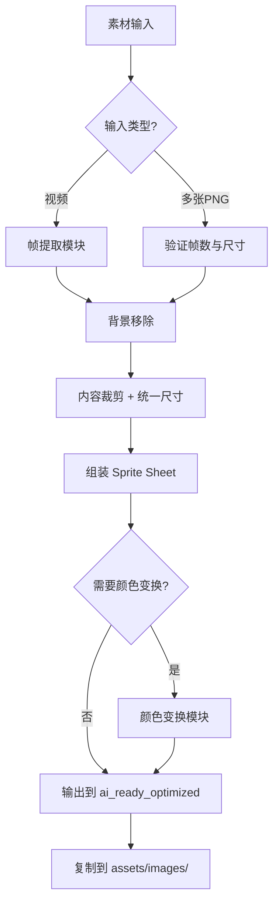

# AI AGENT RULES: ANIMATION TEXTURE PIPELINE
# AI 代理规则：动画纹理流水线

> [!TIP]
> **Pipeline Status**: ✅ IMPLEMENTED (2026-01-16, v3.0)
> - `scripts/process_image_strip.py` - ⭐图片条处理(推荐)
> - `scripts/process_timeline_video.py` - 时间线视频切割与音效提取
> - `scripts/process_animation_frames.py` - PNG序列组装
> - `scripts/color_transform.py` - 主题颜色变换
> - `scripts/preview_spritesheet.py` - Sprite Sheet预览

**CRITICAL INSTRUCTION TO AI ASSISTANTS (关键指令给AI助手)**:
当用户需要为游戏对象添加 4帧 或 16帧 动画纹理时，必须严格遵循本文档的流水线。

---

## 📋 目录

1. [概述与设计原则](#1-概述与设计原则)
2. [实体类型与动画模式](#2-实体类型与动画模式)
3. [素材输入规范](#3-素材输入规范)
4. [⭐图片生成模式(推荐)](#4-图片生成模式推荐)
5. [视频生成模式(备用)](#5-视频生成模式备用)
6. [帧提取与处理流程](#6-帧提取与处理流程)
7. [颜色变换系统](#7-颜色变换系统)
8. [命名规范](#8-命名规范)
9. [目录结构](#9-目录结构)
10. [Java集成指南](#10-java集成指南)
11. [交互协议](#11-交互协议)

---

## 1. 概述与设计原则

### 1.1 流水线目标
本流水线用于将 **循环动画素材** 转化为游戏可用的 **Sprite Sheet**，支持：
- ✅ 4帧动画 (适合简单循环：发光、摆动)
- ✅ 16帧动画 (适合复杂循环：火焰、水流、机械运转)
- ✅ 16+1帧动画 (16帧循环 + 1帧死亡/销毁状态)

### 1.2 设计原则 (Design Principles)

| 原则 | 说明 |
|------|------|
| **一致性 (Consistency)** | 与现有 `ASSET_PIPELINE_RULES_FOR_AI.md` 保持相同的目录结构和处理流程 |
| **主题适配 (Theme Adaptation)** | 所有动画必须符合5大主题风格：grassland, desert, ice, jungle, space |
| **幂等性 (Idempotency)** | 同一输入多次运行应产生相同输出 |
| **可追溯性 (Traceability)** | 保留原始素材和中间产物用于调试 |
| **风格统一 (Style Unity)** | 参考 `AI_TEXTURE_PROMPT_BIBLE.md` 确保视觉一致性 |

---

## 2. 实体类型与动画模式

> [!IMPORTANT]
> **灵活配置**：根据实体特性选择合适的动画模式，不是所有移动物体都需要8套动画！

### 2.1 三种动画模式

| 模式 | 描述 | 动画组数 | 典型实体 |
|------|------|---------|---------|
| **A. 方向敏感型** | 需要区分4个方向 | 4-8组 | 敌人、NPC、角色 |
| **B. 非方向敏感型** | 不区分方向，通用动画 | 1-2组 | 龙卷风、探照灯、外星飞船、能量球 |
| **C. 静态型** | 固定位置，仅循环动画 | 1组 | 陷阱、爆炸特效、雕塑、墙体装饰 |

---

### 2.2 实体结构精细分类 (Entity Structural Classification) ⭐新增核心

为了生成更自然、符合生物力学的动画，**prompt必须包含结构分类信息**。请参考以下分类进行Prompt设计：

#### **Type I: 双足生物 (Bipeds)**
- **特征**: 两条腿，直立或半直立行走。
- **关键点**: 手臂摆动 (Arm Swing)、膝盖弯曲 (Knee Bending)、重心上下起伏 (Bobbing)。
- **Prompt 关键词**: `bipedal`, `standing`, `walking cycle`, `swinging arms`.
- **典型例子**: `Humans`, `Orcs`, `Skeletons`, `Zombies`.

#### **Type II: 四足生物 (Quadrupeds)**
- **特征**: 四条腿，水平躯干。这是最容易出错的类型（脚的数量、步态）。
- **关键点**: 对角线步态 (Diagonal Gait - 左前+右后 / 右前+左后) 或 溜蹄 (Pacing)。
- **Prompt 关键词**: `quadruped`, `4 legs`, `animal gait`, `trotting`.
- **典型例子**: `Boar` (野猪), `Wolf`, `Horse`, `Bear`.
- **🚨 注意**: 必须强调 `4 legs`，避免AI画成多腿怪物。

#### **Type III: 漂浮/飞行生物 (Floating/Flying)**
- **特征**: 无腿或腿部不接触地面，主体悬空。
- **关键点**: 悬浮感 (Hovering)、上下浮动 (Sine wave motion)、翅膀/推进器动作。
- **Prompt 关键词**: `floating`, `hovering`, `flying`, `no legs`, `levitating`.
- **典型例子**: `Ghost`, `Beholder`, `Drone`, `Spaceship`, `Bat`.

#### **Type IV: 爬行/软体生物 (Slithering/Crawling)**
- **特征**: 腹部贴地，无腿或多腿（昆虫）。
- **关键点**: 伸缩运动 (Squash & Stretch)、蜿蜒移动 (Wiggle)。
- **Prompt 关键词**: `crawling`, `slithering`, `ooing`, `slime`, `snake-like`.
- **典型例子**: `Snake`, `Slime`, `Spider` (Multiped), `Worm`.

#### **Type V: 滚动/无机物 (Rolling/Inanimate)**
- **特征**: 刚体或球体，通过滚动或整体平移移动。
- **关键点**: 旋转 (Rotating) 或 无动作平移。
- **Prompt 关键词**: `rolling`, `spinning`, `rigid body`.
- **典型例子**: `Rolling Stone`, `Tumbleweed`, `Ball`.

---

### 2.2 模式A：方向敏感型 (敌人/NPC)

**根据需要选择动画组**：

| 动画组 | 是否必须 | 描述 |
|-------|---------|------|
| walk_down | ✅ 推荐 | 向下(朝向玩家)移动 |
| walk_right | ✅ 推荐 | 向右移动 |
| walk_up | ⬜ 可选 | 向上移动 (可用down翻转) |
| walk_left | ⬜ 可选 | 向左移动 (可用right翻转) |
| attack_down | ⬜ 可选 | 向下攻击 |
| attack_right | ⬜ 可选 | 向右攻击 |
| attack_up | ⬜ 可选 | 向上攻击 |
| attack_left | ⬜ 可选 | 向左攻击 |
| death | ⬜ 可选 | 死亡动画 |
| idle | ⬜ 可选 | 待机动画 |

**最小配置**: walk_down + walk_right (其他可翻转生成)
**标准配置**: 4方向移动
**完整配置**: 4方向移动 + 4方向攻击 + 死亡

---

### 2.3 模式B：非方向敏感型 (龙卷风/飞船/能量体)

**只需通用动画，不区分方向**：

| 动画组 | 用途 | 描述 |
|-------|------|------|
| move | 移动时播放 | 通用移动/漂浮动画 |
| attack | 攻击时播放 | 攻击/释放技能动画 |
| idle | 待机时播放 | 静止待机动画 (可选) |
| death | 被击杀时播放 | 消散/爆炸动画 (可选) |

**典型配置**: move + attack (2组动画即可)

---

### 2.4 模式C：静态型 (陷阱/特效/装饰)

**固定位置，仅循环动画**：

| 动画组 | 用途 | 示例 |
|-------|------|------|
| idle/loop | 常态循环 | 火焰陷阱燃烧、能量场脉动 |
| activate | 触发时播放 | 陷阱激活、机关启动 |
| explode | 爆炸效果 | 炸弹爆炸、水晶碎裂 |
| death | 销毁效果 | 墙体崩塌、雕塑倒塌 |

**典型配置**: idle (仅1组4帧循环)

---

### 2.5 应用场景速查表

| 实体 | 模式 | 建议动画组 |
|------|------|-----------|
| 野猪/敌人 | A-方向敏感 | walk×4 + attack×4 |
| 史莱姆 | A-方向敏感 | walk×2 (左右翻转) |
| 龙卷风 | B-非方向敏感 | move + attack |
| 探照灯 | B-非方向敏感 | move (旋转) + attack (锁定) |
| 外星飞船 | B-非方向敏感 | move + attack + death |
| 火焰陷阱 | C-静态 | idle (燃烧循环) |
| 爆炸特效 | C-静态 | explode (单次播放) |
| 能量雕塑 | C-静态 | idle (发光脉动) |
| 墙体装饰 | C-静态 | idle (轻微动效) |

---

### 2.6 音效配套规范 ⭐重要

> [!CAUTION]
> **每个动画组必须有对应的音效！**

| 动画组 | 对应音效 | 文件命名 |
|-------|---------|---------|
| walk/move | 移动音效 | `{entity}_move.ogg` |
| attack | 攻击音效 | `{entity}_attack.ogg` |
| death | 死亡音效 | `{entity}_death.ogg` |
| idle | 环境音(可选) | `{entity}_idle.ogg` |
| explode | 爆炸音效 | `{entity}_explode.ogg` |

**音效存放位置**: `assets/audio/sfx/entities/`

## 3. 素材输入规范

### 3.1 用户提供多张PNG时

**文件要求**:
- ✅ 透明背景 (Alpha Channel)
- ✅ 一致的尺寸 (所有帧大小相同)
- ✅ 按序命名或描述顺序

**命名建议** (非强制，但推荐):
```
frame_01.png, frame_02.png, ... frame_16.png
或
fire_1.png, fire_2.png, ... fire_4.png
```

**放置位置**:
```
raw_assets/animations/{entity_name}/frame_01.png
raw_assets/animations/{entity_name}/frame_02.png
...
```

### 3.2 用户提供视频时

**文件要求**:
- ✅ 循环流畅 (首尾帧视觉上可衔接)
- ✅ 主体清晰可辨
- ✅ 背景尽量纯净 (便于后期处理)

**放置位置**:
```
raw_assets/videos/{entity_name}.mp4
```

---

### 3.3 多行网格图片规范 (Standard Grid Layout) ⭐核心

当用户提供包含多行的合并大图时，**必须**严格遵循以下标准顺序：

**标准一：方向视图 (Sides/Views)**
如果一张图片包含不同视角的动画，**必须**按以下行顺序排列：

| 行号 (0-index) | 内容 | 对应文件名标记 | 备注 |
|---|---|---|---|
| Row 0 | **Right** View | `walk_right` / `attack_right` | 标准侧视图 |
| Row 1 | **Left** View | `walk_left` / `attack_left` | 镜像侧视图 |
| Row 2 | **Down** View (Front) | `walk_down` / `attack_down` | 正面视图 |
| Row 3 | **Up** View (Back) | `walk_up` / `attack_up` | 背面视图 |

**使用示例**：
```bash
# 处理包含 Right/Left 两行的图片
python3 scripts/process_image_strip.py \
  --input raw_assets/images/boar_sides.png \
  --rows 2 \
  --row-names "walk_right,walk_left"  <-- 必须匹配标准顺序
```

> [!CAUTION]
> **严禁反向！** 务必检查 Row 0 是向右，Row 1 是向左。如果原图反了，请在命令中互换参数，或者先编辑原图。

> [!TIP]
> **资源优化技巧**：
> 如果你的侧视图是对称的，可以只准备 **Left View (或 Right View)** 一行。
> 处理时加上 `--auto-mirror` 参数，脚本会自动生成缺失的另一侧。


---

## 4. ⭐图片生成模式 (推荐)

> [!TIP]
> **推荐使用图片生成**：比视频生成省额度、质量更可控！

### 4.1 输入格式

**单张图片包含4帧**，水平排列：

```
┌─────────────────────────────────────────────────────────┐
│  Frame 1  │  Frame 2  │  Frame 3  │  Frame 4  │
│  128×128  │  128×128  │  128×128  │  128×128  │
└─────────────────────────────────────────────────────────┘
总尺寸: 512×128 px
```

**放置位置**:
```
raw_assets/images/{entity}_{animation}.png
例: raw_assets/images/boar_walk_down.png
```

---

### 4.3 品红辅助线系统 ⭐关键

> [!IMPORTANT]
> **辅助线用于确保4帧物体中心对齐！**

**规格**：
- 颜色：**品红 #FF00FF** (与任何游戏主题色差异最大)
- 宽度：1-2像素
- 位置：每帧正中心的十字线

```
┌─────────┬─────────┬─────────┬─────────┐
│    │    │    │    │    │    │    │    │
│ ───┼─── │ ───┼─── │ ───┼─── │ ───┼─── │  ← 品红十字线
│    │    │    │    │    │    │    │    │
│   🐗    │   🐗    │   🐗    │   🐗    │  ← 物体居中
└─────────┴─────────┴─────────┴─────────┘
```

**Prompt关键词**：
```
Draw thin MAGENTA (#FF00FF) crosshair guidelines at the exact center of each frame.
1-2 pixels wide, vertical and horizontal lines crossing at center.
The creature must be CENTERED precisely on these crosshairs in every frame.
```

**处理脚本**会自动：
1. 检测品红辅助线位置
2. 按辅助线边界切割帧
3. 移除辅助线（变透明）
4. 移除白色背景
5. 对齐物体中心

---

### 4.2 AI Prompt 策略 (Prompt Strategy) ⭐核心

在给绘画AI (如 Midjourney, DALL-E 3) 写 Prompt 时，请遵循 **"分类+视角+动作"** 的公式。**结构分类** (参见 2.2) 是确保解剖正确的关键。

**通用公式**:
`[View Angle] sprite sheet of a [Entity Class] [Entity Name], [Action], [Art Style], [Background]`

**各分类 Prompt 示例**:

1.  **Quadruped (Boar)**:
    > "Orthographic top-down sprite sheet of a **quadruped** wild boar, **4 legs visible**, walking animation, gait cycle, game asset style, white background."

2.  **Biped (Orc)**:
    > "Orthographic top-down sprite sheet of a **bipedal** orc warrior, walking cycle, swinging arms, strong stance, game asset style, white background."

3.  **Floating (Ghost)**:
    > "Orthographic top-down sprite sheet of a **floating** ghost, hovering in air, no legs, ethereal movement, game asset style, white background."

---

### 4.4 核心规则 (经验教训)

> [!CAUTION]
> **从测试中学到的关键教训**：
> 1. 背景必须是**绝对纯白 #FFFFFF** - 任何灰色都会导致边缘残留
> 2. 4帧之间的差异必须**肉眼明显可见** - 不能几乎一样
> 3. 品红辅助线可以正确检测，但要避免放在图片最边缘

| 规则 | 正确 ✅ | 错误 ❌ | Prompt强调 |
|------|--------|--------|-----------|
| 背景 | **绝对纯白 #FFFFFF** | 灰色/渐变 | `PURE WHITE background, RGB(255,255,255), NO gray` |
| 帧差异 | **每帧明显不同** | 4帧几乎一样 | `Each frame VISIBLY DIFFERENT, obvious changes` |
| 位置 | 物体**正中央** | 位置偏移 | `CENTERED on crosshairs` |
| 大小 | 所有帧**完全一致** | 大小变化 | `SAME SIZE in all frames` |
| 辅助线 | 品红#FF00FF | 其他颜色 | `MAGENTA (#FF00FF) crosshairs` |

---

### 4.5 通用动画关键帧系统 ⭐核心

> [!IMPORTANT]
> **4帧动画的核心原则**：
> 1. 第4帧必须能自然过渡回第1帧（循环性）
> 2. 每帧变化要**明显但不剧烈**（可辨识但流畅）
> 3. 描述具体变化维度（旋转?形变?发光?）

---

#### 类型A: 有腿生物（野猪、史莱姆脚、蜘蛛）

**变化维度**：腿部位置交替

| 帧 | 关键帧 | 描述 |
|----|-------|------|
| 1 | Contact Right | 右腿前伸触地，左腿后抬 |
| 2 | Passing Right | 右腿支撑，左腿经过身体 |
| 3 | Contact Left | 左腿前伸触地，右腿后抬 |
| 4 | Passing Left | 左腿支撑，右腿经过身体 |

**Prompt片段**：
```
ANIMATION: 4-frame walk cycle
- Frame 1: Right leg forward, left leg back
- Frame 2: Right leg flat, left leg passing
- Frame 3: Left leg forward, right leg back  
- Frame 4: Left leg flat, right leg passing
```

---

#### 类型B: 无腿生物（史莱姆、幽灵、水母）

**变化维度**：身体形变（挤压/拉伸）

| 帧 | 关键帧 | 描述 |
|----|-------|------|
| 1 | Squash | 身体横向压扁，矮胖状态 |
| 2 | Neutral Up | 恢复正常，略向上移动 |
| 3 | Stretch | 身体纵向拉长，瘦高状态 |
| 4 | Neutral Down | 恢复正常，略向下移动 |

**Prompt片段**：
```
ANIMATION: 4-frame bounce/hover cycle (NO LEGS)
- Frame 1: Body SQUASHED horizontally (wider, shorter)
- Frame 2: Body returns to normal, moving upward
- Frame 3: Body STRETCHED vertically (taller, thinner)
- Frame 4: Body returns to normal, moving downward
Creates bouncing/hovering motion when looped.
```

---

#### 类型C: 旋转物体（齿轮、风扇、雷达、探照灯）

**变化维度**：旋转角度

| 帧 | 关键帧 | 描述 |
|----|-------|------|
| 1 | 0° | 初始位置 |
| 2 | 90° | 顺时针旋转90度 |
| 3 | 180° | 顺时针旋转180度 |
| 4 | 270° | 顺时针旋转270度 |

**Prompt片段**：
```
ANIMATION: 4-frame rotation cycle
- Frame 1: Object at 0° (starting position)
- Frame 2: Object rotated 90° clockwise
- Frame 3: Object rotated 180° clockwise
- Frame 4: Object rotated 270° clockwise
Loops back to frame 1 (360° = 0°) for continuous rotation.
```

---

#### 类型D: 脉动发光（能量球、魔法阵、水晶）

**变化维度**：发光强度 + 轻微尺寸变化

| 帧 | 关键帧 | 描述 |
|----|-------|------|
| 1 | Dim | 最暗状态，最小尺寸 |
| 2 | Brightening | 亮度增加，尺寸略大 |
| 3 | Bright | 最亮状态，最大尺寸 |
| 4 | Dimming | 亮度减少，尺寸略小 |

**Prompt片段**：
```
ANIMATION: 4-frame glow pulse cycle
- Frame 1: DIMMEST glow, slightly smaller (95% size)
- Frame 2: Medium glow, normal size (100%)
- Frame 3: BRIGHTEST glow, slightly larger (105% size)
- Frame 4: Medium glow, normal size (100%)
Creates pulsing glow effect when looped.
```

---

#### 类型E: 火焰/烟雾/流体

**变化维度**：形状形变 + 内部细节变化

| 帧 | 关键帧 | 描述 |
|----|-------|------|
| 1 | Shape A | 火焰向左倾斜，火舌形态A |
| 2 | Shape B | 火焰居中，火舌形态B |
| 3 | Shape C | 火焰向右倾斜，火舌形态C |
| 4 | Shape D | 火焰居中，火舌形态D (不同于B) |

**Prompt片段**：
```
ANIMATION: 4-frame flickering flame cycle
- Frame 1: Flame leans LEFT, tongues pattern A
- Frame 2: Flame centered, tongues pattern B
- Frame 3: Flame leans RIGHT, tongues pattern C
- Frame 4: Flame centered, tongues pattern D (different from B)
Each frame has DIFFERENT flame shape but SAME overall size/position.
```

---

#### 类型F: 攻击/冲击动作（单次非循环）

**变化维度**：动作阶段

| 帧 | 关键帧 | 描述 |
|----|-------|------|
| 1 | Windup | 蓄力阶段，身体后仰 |
| 2 | Strike | 攻击瞬间，身体前冲 |
| 3 | Impact | 命中效果，最大延展 |
| 4 | Recovery | 恢复阶段，回到待机 |

**Prompt片段**：
```
ANIMATION: 4-frame attack sequence (NOT looping)
- Frame 1: WINDUP - body pulls back, preparing
- Frame 2: STRIKE - body lunges forward, weapon swings
- Frame 3: IMPACT - maximum extension, hit effect
- Frame 4: RECOVERY - body returns to neutral stance
```

---

### 4.5 动画类型速查表

| 物体 | 动画类型 | 变化维度 |
|------|---------|---------|
| 野猪、敌人 | A-有腿 | 腿部交替 |
| 史莱姆、幽灵 | B-无腿 | 挤压拉伸 |
| 齿轮、风扇 | C-旋转 | 角度变化 |
| 能量球、水晶 | D-脉动 | 发光+尺寸 |
| 火焰、烟雾 | E-流体 | 形态变化 |
| 攻击、爆炸 | F-单次 | 动作阶段 |
| 龙卷风 | C+D混合 | 旋转+脉动 |
| 激光炮 | D+F混合 | 充能+发射 |

---

### 4.5 Prompt模板：4帧图片条

**草原野猪向下走 (walk_down)**:

```
4-FRAME ANIMATION SPRITE STRIP - Wild Boar Walk Down

Create a SINGLE image containing 4 animation frames arranged horizontally.
Total image size: 512×128 pixels (4 frames × 128px each)

=== LAYOUT ===
[Frame 1] | [Frame 2] | [Frame 3] | [Frame 4]
Each frame is exactly 128×128 pixels, square.

=== CRITICAL REQUIREMENTS ===
1. Pure WHITE #FFFFFF background - NO gradients, NO textures
2. Each frame has MAGENTA (#FF00FF) crosshair at exact center (1-2px thin lines)
3. Boar must be CENTERED on crosshairs in EVERY frame - same position
4. Boar must be EXACTLY SAME SIZE in all 4 frames
5. Boar faces TOWARD camera (front view) in all frames
6. NO movement - boar stays in place, only LEGS animate (marching in place)

=== ANIMATION KEYFRAMES (Walk Cycle) ===
- Frame 1: Right leg forward touching ground, left leg back lifted (Contact Right)
- Frame 2: Right leg flat, left leg passing through mid-stride (Passing Right)  
- Frame 3: Left leg forward touching ground, right leg back lifted (Contact Left)
- Frame 4: Left leg flat, right leg passing through mid-stride (Passing Left)
Loop 1→2→3→4→1 creates smooth walking animation.

=== SUBJECT ===
Cute chunky wild boar, 16-bit pixel art, SNES RPG style.
Green-brown fur, white tusks, red angry eyes.
Grassland theme color palette.
Creature fills about 80% of each frame (10% padding each side).

--no 3D, photorealism, blur, anti-aliasing, gradient background, actual movement
```

---

### 4.6 处理命令

**基本处理**:
```bash
python3 scripts/process_image_strip.py \
  --input raw_assets/images/boar_walk_down.png \
  --frames 4 \
  --name mob_boar_walk_down \
  --auto-mirror  # ⭐ 自动生成镜像 (传入Left自动生Right，反之亦然)
```

**多行处理 (Grid)**:
```bash
python3 scripts/process_image_strip.py \
  --input raw_assets/images/boar_sides.png \
  --rows 2 \
  --row-names "walk_left,walk_right" \
  --name mob_boar
# 如果只有一行 walk_left，加上 --auto-mirror 即可自动生成 walk_right
```

---

## 5. 视频生成模式 (备用)

当用户无现成素材，需要 AI 生成动画视频时，使用以下工作流。

> [!IMPORTANT]
> **时间线切割原则**：视频按时间顺序依次展示各动画状态，脚本按时间戳切割提取帧，而非空间Grid切割！

### 4.1 触发条件
用户说：**"我需要一个 [主题] 风格的 [物品名/怪物名] 动画"** 或类似表述。

### 4.2 确认动画需求

AI必须与用户确认：
1. **动画模式**: A/B/C (方向敏感/非方向敏感/静态)
2. **需要哪些动画组**: 如 move + attack，或 walk×4 + attack×4
3. **每组帧数**: 通常4帧
4. **是否需要音效**: 是

---

### 4.3 时间线布局规范 ⭐核心

**视频时间线结构**：各动画组按时间顺序排列，每组之间有明确的视觉分隔标记。

```
视频时间线 (Timeline):
┌────────────────────────────────────────────────────────────────────┐
│ 0s      1s      2s      3s      4s      5s      6s      7s      8s │
├────────┬───────┬───────┬───────┬───────┬───────┬───────┬──────────┤
│ walk_dn│walk_rt│walk_up│walk_lt│atk_dn │atk_rt │atk_up │ atk_lt   │
│ 4帧    │ 4帧   │ 4帧   │ 4帧   │ 4帧   │ 4帧   │ 4帧   │ 4帧      │
└────────┴───────┴───────┴───────┴───────┴───────┴───────┴──────────┘
每秒约4帧 = 每个动画组约1秒时长
```

**时间戳标记系统**：
- 每个动画组开始时，画面左上角显示文字标记
- 格式：`[动画组名称]` 例如 `[WALK_DOWN]`, `[ATTACK]`, `[MOVE]`
- 标记持续约0.5秒后消失，帧正式开始

---

### 4.4 风格锚定关键词

```text
16-bit pixel art style, retro SNES RPG aesthetic, 
game sprite animation, limited color palette (max 16 colors), 
crisp pixel edges, no anti-aliasing, no blur,
top-down 3/4 perspective view,
[Theme Keywords]
```

**主题关键词**：

| 主题 | 颜色和风格 |
|------|-----------|
| Grassland | Forest green, earthy brown, sunlit warm tones |
| Desert | Sand gold, terracotta, heat wave effect |
| Ice | Crystal cyan, frost white, cold blue shimmer |
| Jungle | Deep emerald, bioluminescent purple, misty |
| Space | Neon cyan, electric purple, chrome metallic |

---

### 4.5 音效生成规范 ⭐重要

> [!CAUTION]
> **视频必须包含对应音效，音轨与动画同步！**

**Prompt中必须声明**：
```text
Include sound effects for each animation state, synchronized with visuals.
NO background music, NO ambient BGM.
Only creature/object sound effects: footsteps, attack sounds, explosion, etc.
Clear audio separation between animation segments.
```

**音效时间对应**：
```
视频时间线:
0-1s: walk_down → 音效: 脚步声 × 4
1-2s: walk_right → 音效: 脚步声 × 4
2-3s: attack_down → 音效: 攻击音 × 1 (在攻击帧)
...
```

---

### 4.6 ⭐⭐ Prompt关键规则 (必读)

> [!CAUTION]
> **以下规则必须在每个Prompt中严格遵守！**

| 规则 | 正确 ✅ | 错误 ❌ |
|------|--------|--------|
| 位置 | 物体始终在画面**正中央** | 物体在视频中移动/平移 |
| 背景 | **纯白 #FFFFFF** 背景 | 带纹理/渐变/场景背景 |
| 方向动画 | 面朝该方向 + **原地踏步** | 真的往那个方向移动 |
| 时间段 | 每个时间段**只显示一个动画** | 多个动画同时出现 |
| 攻击动画 | 面朝攻击方向 + 原地攻击动作 | 冲向目标 |

**方向动画详解**：
- `walk_down` = 面朝摄像头(正面)，原地踏步，腿部循环动作
- `walk_right` = 面朝右侧(侧面)，原地踏步，腿部循环动作
- `walk_up` = 背对摄像头(背面)，原地踏步，腿部循环动作
- `walk_left` = 面朝左侧(侧面)，原地踏步，腿部循环动作
- `attack_down` = 面朝摄像头，原地挥舞武器/冲撞动作
- 游戏中的**移动是通过改变物体坐标实现**，不是动画自身移动！

---

### 4.7 Prompt模板：方向敏感型 (模式A)

**草原野猪示例** (walk×4 + attack×4 = 8组)：

```
ANIMATION VIDEO PROMPT - Grassland Wild Boar Enemy

Create a 16-bit pixel art style animation video.
Subject: Cute angry wild boar creature - chunky small boar with green-brown fur, white tusks, glowing red angry eyes.
Theme: Grassland RPG enemy, retro SNES aesthetic.

=== CRITICAL RULES ===
1. The boar must ALWAYS stay in the EXACT CENTER of the frame - NO movement across the screen
2. Background must be PURE WHITE (#FFFFFF) - no gradients, no textures, no scenery
3. Only ONE animation state visible at a time - NO overlapping or multiple boars
4. "Walking" means FACING that direction + MARCHING IN PLACE (legs moving but body stationary)
5. "Attack" means FACING that direction + ATTACK MOTION IN PLACE (no charging forward)

=== VIDEO TIMELINE (8 seconds, 4fps, 4 frames per segment) ===

SEGMENT 1 (0-1s): [WALK_DOWN]
- Boar facing TOWARD camera (front view)
- Legs doing walking cycle animation IN PLACE
- Body stays centered, does not move down
- Small dust puffs at feet

SEGMENT 2 (1-2s): [WALK_RIGHT]  
- Boar facing RIGHT (side profile view)
- Legs doing walking cycle animation IN PLACE
- Body stays centered, does not move right
- Side view trotting motion

SEGMENT 3 (2-3s): [WALK_UP]
- Boar facing AWAY from camera (back view)
- Legs doing walking cycle animation IN PLACE
- Body stays centered, does not move up
- Tail visible, back of head shown

SEGMENT 4 (3-4s): [WALK_LEFT]
- Boar facing LEFT (side profile view, mirror of right)
- Legs doing walking cycle animation IN PLACE
- Body stays centered, does not move left

SEGMENT 5 (4-5s): [ATTACK_DOWN]
- Boar facing TOWARD camera
- Headbutt attack motion IN PLACE (tusks thrust forward then back)
- Body stays centered, does not charge forward

SEGMENT 6 (5-6s): [ATTACK_RIGHT]
- Boar facing RIGHT
- Side attack motion IN PLACE (tusks swing)
- Body stays centered

SEGMENT 7 (6-7s): [ATTACK_UP]
- Boar facing AWAY from camera
- Rear kick attack motion IN PLACE
- Body stays centered

SEGMENT 8 (7-8s): [ATTACK_LEFT]
- Boar facing LEFT (mirror of right attack)
- Side attack motion IN PLACE
- Body stays centered

=== VISUAL STYLE ===
- Pure white #FFFFFF background, completely flat
- Crisp pixel art edges, no anti-aliasing
- Limited 16-color palette: forest green, earthy brown, white, red, tan
- Each segment clearly separated, only one boar visible at any time

=== AUDIO ===
Sound effects only, NO background music:
- Walk segments: soft hoofstep sounds (4 per segment)
- Attack segments: angry grunt + impact thud

--no 3D, photorealism, blur, gradient background, scene background, moving camera, multiple creatures, BGM
```

### 4.7 Prompt模板：非方向敏感型 (模式B)

**外星飞船示例** (move + attack + death = 3组)：

```
ANIMATION VIDEO PROMPT - Space UFO Enemy

Create a 16-bit pixel art animation video of a small alien spaceship.
Space theme RPG enemy, retro sci-fi aesthetic.
Silver metallic saucer with glowing cyan lights, purple energy core.

VIDEO TIMELINE (3 seconds total, 4 frames per second):
- 0-1s: [MOVE] - Hovering motion, slight bob up/down, lights pulsing
- 1-2s: [ATTACK] - Charging laser beam, energy gathering, beam fires
- 2-3s: [DEATH] - Explosion, sparks flying, debris scattering

Each segment starts with text label "[SEGMENT_NAME]" in top-left corner (0.25s), then 4 animation frames.
White background, centered spaceship.
Crisp pixel edges, neon glow effects.

AUDIO: Include sound effects only, NO background music.
- Move: low engine hum
- Attack: laser charging + beam fire
- Death: explosion boom
Clear audio separation per segment.

--no 3D, photorealism, blur, anti-aliasing, BGM, ambient music
```

---

### 4.8 Prompt模板：静态型 (模式C)

**火焰陷阱示例** (idle循环)：

```
ANIMATION VIDEO PROMPT - Fire Trap

Create a 16-bit pixel art animation video of a floor fire trap.
Desert theme game trap, retro RPG aesthetic.
Metal grate with flames bursting up periodically.

VIDEO TIMELINE (1 second total, 4 frames per second):
- 0-1s: [IDLE] - Flames flickering cycle, 4 frames seamless loop

Text label "[IDLE]" in top-left corner at start.
White background, centered trap.
Crisp pixel edges, warm fire colors (orange, red, yellow).

AUDIO: Include sound effects only, NO background music.
- Idle: crackling fire loop

--no 3D, photorealism, blur, anti-aliasing, BGM
```

**爆炸特效示例** (单次播放)：

```
ANIMATION VIDEO PROMPT - Explosion Effect

Create a 16-bit pixel art animation video of an explosion effect.
Universal game VFX, retro arcade aesthetic.
Bright orange/yellow explosion with smoke.

VIDEO TIMELINE (1 second, 4 frames):
- 0-1s: [EXPLODE] - Flash → Fireball expand → Smoke disperse → Fade

Text label "[EXPLODE]" in top-left corner at start.
Transparent/black background for overlay usage.
Crisp pixel edges, high contrast.

AUDIO: Single explosion boom sound.

--no 3D, photorealism, blur
```

---

### 4.9 视频接收后的处理

**用户将视频放入后的流程**：

1. 用户说：**"视频已放入 [路径]"**
2. AI执行时间线切割脚本：
   ```bash
   python3 scripts/process_timeline_video.py \
     --input raw_assets/videos/boar_grassland.mp4 \
     --config "walk_down:0-1,walk_right:1-2,walk_up:2-3,walk_left:3-4,attack_down:4-5,attack_right:5-6,attack_up:6-7,attack_left:7-8" \
     --frames-per-segment 4 \
     --name mob_boar_grassland
   ```
3. 脚本自动：
   - 按时间戳切割视频段
   - 从每段提取等间隔帧
   - 移除背景
   - 提取对应时段音频
   - 生成Sprite Sheet + 音效文件

---

### 4.10 推荐的外部视频生成工具

| 工具 | 特点 | 音效支持 |
|------|------|---------|
| **Runway Gen-3** | 视频质量高，理解时间线 | ❌ 需单独生成 |
| **Pika Labs** | 快速迭代 | ❌ |
| **Kling AI** | 中国区可用 | ❌ |
| **Suno AI** | 音效生成 | ✅ 专门用于音效 |
| **ElevenLabs SFX** | 专业音效 | ✅ |

**音效生成建议**：如果视频工具不支持音效，单独使用 Suno AI 或 ElevenLabs 生成对应的 sound effects，确保时长匹配。

---

## 5. 帧提取与处理流程

### 5.1 Python 脚本：`process_animation_frames.py`

**功能**:
1. 从视频中均匀提取指定帧数
2. 移除背景 (白色/纯色背景)
3. 裁剪内容边界
4. 统一尺寸
5. 组装为 Sprite Sheet

**执行命令**:
```bash
# 提取4帧动画
python3 scripts/process_animation_frames.py --input raw_assets/videos/fire_trap.mp4 --frames 4

# 提取16帧动画
python3 scripts/process_animation_frames.py --input raw_assets/videos/energy_crystal.mp4 --frames 16

# 从PNG文件夹组装
python3 scripts/process_animation_frames.py --input raw_assets/animations/my_anim/ --frames 4
```

### 5.2 用户直接提供PNG时的流程

```bash
# 将用户提供的PNG放入指定文件夹后
python3 scripts/process_animation_frames.py --input raw_assets/animations/{name}/ --frames [4|16|17]

# 脚本自动识别文件夹中的PNG并按文件名排序组装
```

### 5.3 处理流程图



---

## 6. 颜色变换系统

### 6.1 设计目标
通过 **色彩空间映射变换**，从一套基础动画素材生成适配不同主题的变体。

### 6.2 主题色彩映射表

| 基础色调 | Grassland | Desert | Ice | Jungle | Space |
|---------|-----------|--------|-----|--------|-------|
| 红色系 | 翠绿 #2ECC71 | 橙红 #E74C3C | 冰蓝 #3498DB | 深绿 #27AE60 | 霓虹红 #E91E63 |
| 蓝色系 | 天蓝 #5DADE2 | 沙金 #F39C12 | 深青 #00BCD4 | 蓝紫 #8E44AD | 电光蓝 #00E5FF |
| 黄色系 | 嫩绿 #A3E635 | 土黄 #D4AC0D | 银白 #ECF0F1 | 金棕 #B8860B | 霓虹紫 #9C27B0 |
| 中性灰 | 草地棕 #795548 | 沙漠棕 #A1887F | 冰川灰 #B0BEC5 | 树皮褐 #5D4037 | 金属灰 #546E7A |

### 6.3 变换模式

| 模式 | 适用场景 | 变换原理 |
|------|---------|---------|
| **色相旋转 (Hue Shift)** | 全局色调改变 | HSV空间中H值偏移 |
| **调色板映射 (Palette Map)** | 精确颜色替换 | 定义源色→目标色映射表 |
| **色温调整 (Temperature)** | 冷/暖主题适配 | R/B通道加权 |

### 6.4 Python 脚本：`color_transform.py`

**执行命令**:
```bash
# 将基础动画转换为各主题变体
python3 scripts/color_transform.py --input raw_assets/ai_ready_optimized/anim_fire_4f.png --mode hue_shift --target ice

# 批量生成所有主题变体
python3 scripts/color_transform.py --input raw_assets/ai_ready_optimized/anim_fire_4f.png --mode palette_map --all-themes
```

### 6.5 ⚠️ 变换约束

| ❌ 禁止 | ✅ 允许 |
|--------|--------|
| 将深色变纯白 (会被背景移除误判) | 深色变为另一种深色或中间色 |
| 完全去饱和变灰 | 调整饱和度但保留基础色调 |
| 破坏原始对比度 | 保持明暗层次关系 |

---

## 7. Sprite Sheet 组装规范

### 7.1 布局标准

**水平条布局 (Horizontal Strip)**:
```
┌────────────────────────────────────────────┐
│ Frame1 │ Frame2 │ Frame3 │ Frame4 │ ...   │
│  64x64 │  64x64 │  64x64 │  64x64 │       │
└────────────────────────────────────────────┘
```

**死亡帧处理 (16+1帧)**:
- **方案A (推荐)**: 分离为两个文件
  - `anim_{name}_16f.png` (循环动画)
  - `anim_{name}_death.png` (死亡帧，单帧)
  
- **方案B**: 合并为17帧条
  - `anim_{name}_17f.png` (最后一帧为死亡)

### 7.2 尺寸标准

| 单帧目标尺寸 | 适用对象 |
|-------------|---------|
| **64×64 px** | 标准游戏实体 (陷阱、道具、小型敌人) |
| **128×128 px** | 大型实体 (Boss、大型障碍) |
| **自定义** | 墙体动画 (遵循墙体尺寸规范：2x2.5, 3x3.5 等) |

---

## 8. 命名规范

### 8.1 命名模式

| 类型 | 命名格式 | 示例 |
|------|---------|------|
| **通用动画** | `anim_{entity}_{theme}_{frames}f.png` | `anim_crystal_ice_4f.png` |
| **陷阱动画** | `anim_trap_{theme}_v{variant}_{frames}f.png` | `anim_trap_space_v1_16f.png` |
| **墙体动画** | `anim_wall_{theme}_{WxH}_v{variant}_{frames}f.png` | `anim_wall_jungle_2x2_v1_4f.png` |
| **道具动画** | `anim_item_{name}_{frames}f.png` | `anim_item_key_glow_4f.png` |
| **死亡帧** | `anim_{entity}_{theme}_death.png` | `anim_crystal_ice_death.png` |

### 8.2 帧数后缀说明

| 后缀 | 含义 |
|------|-----|
| `_4f` | 4帧循环动画 |
| `_16f` | 16帧循环动画 |
| `_17f` | 16帧循环 + 1帧死亡 (合并) |
| `_death` | 单独的死亡帧 |

---

## 9. 目录结构

```
📁 raw_assets/
├── 📁 videos/                          # 视频输入
│   └── fire_trap.mp4
├── 📁 animations/                      # PNG帧输入
│   └── 📁 fire_trap/
│       ├── frame_01.png
│       ├── frame_02.png
│       └── ...
├── 📁 ai_generated_raw/                # AI生成的原始帧 (未处理)
├── 📁 ai_processed_transparent/        # 背景移除后的帧
└── 📁 ai_ready_optimized/              # 组装完成的 Sprite Sheets
    ├── anim_trap_desert_v1_4f.png
    └── anim_crystal_ice_16f.png

📁 assets/images/
├── 📁 animations/                      # 最终游戏使用的动画
│   ├── anim_trap_desert_v1_4f.png
│   └── anim_crystal_ice_16f.png
└── 📁 walls/                           # 墙体动画 (如适用)
```

---

## 10. Java集成指南 (⭐关键步骤)

> [!CAUTION]
> **生成资产文件后必须修改Java代码！**
> 仅将PNG文件放入assets目录是不够的，必须确保代码能加载这些资产。

### 10.1 集成检查清单

| 步骤 | 说明 | 文件 |
|------|------|------|
| 1. 资产处理 | 运行脚本生成Sprite Sheet | `process_image_strip.py` |
| 2. 资产输出 | 确认PNG已复制到 `assets/images/` | 检查目录 |
| 3. **代码加载** | 在TextureManager添加加载逻辑 | `TextureManager.java` |
| 4. **代码使用** | 在GameScreen/实体类使用动画 | `GameScreen.java` |
| 5. 编译测试 | 运行 `./gradlew compileJava` | 终端 |
| 6. 游戏测试 | 运行游戏查看效果 | Desktop启动 |

### 10.2 TextureManager 已实现的方法

当前已实现的动画加载方法：

```java
// 1. 加载水平Sprite Sheet动画
private Animation<TextureRegion> loadSpriteSheetAnimation(
    String path,        // 例如 "images/mobs/mob_boar_walk_down_4f.png"
    int frameCount,     // 帧数，例如 4
    int frameSize,      // 帧尺寸(宽=高)，例如 64
    float frameDuration // 每帧时长，例如 0.15f
);

// 2. 获取野猪动画（按方向）
public Animation<TextureRegion> getBoarAnimation(int direction);
// direction: 0=down, 1=left, 2=up, 3=right

// 3. 获取野猪动画（按速度方向）
public Animation<TextureRegion> getBoarAnimationByVelocity(float vx, float vy);
```

### 10.3 GameScreen 使用示例

在渲染敌人时使用野猪动画：

```java
// 根据敌人移动方向获取动画
float vx = enemy.getVelocityX();
float vy = enemy.getVelocityY();
Animation<TextureRegion> anim = textureManager.getBoarAnimationByVelocity(vx, vy);
TextureRegion frame = anim.getKeyFrame(stateTime, true);

// 渲染
batch.draw(frame, x - width/2, y - height/2, width, height);
```

### 10.4 旧版加载模板 (手动方式)
```

---

## 11. 完整工作流示例

### 示例 A: 用户提供4张PNG → 装填为动画

**用户**: "我有4张火焰陷阱的PNG，放在 `raw_assets/animations/fire_trap/` 了"

**AI操作**:
```bash
# 1. 验证并组装
python3 scripts/process_animation_frames.py --input raw_assets/animations/fire_trap/ --frames 4 --output anim_trap_desert_v1_4f.png

# 2. 复制到游戏目录
cp raw_assets/ai_ready_optimized/anim_trap_desert_v1_4f.png assets/images/animations/
```

---

### 示例 B: 用户需要AI生成 → 外部生成视频 → 提取帧

**用户**: "我需要一个太空主题的能量晶体动画，16帧"

**AI响应** (提供Prompt表格):

| 目标 | 生成Prompt |
|-----|-----------|
| 太空能量晶体 16帧循环 | "Seamless looping animation of a glowing energy crystal, sci-fi space station style. Top-down orthographic view, 2D stylized hand-painted look. Pulsing neon cyan core with electric arcs, rotating holographic rings. Color Palette: Electric Cyan, Neon Purple, Dark Chrome. Clean isolated object, solid black background. Smooth 24fps, perfect loop. --no 3D render, photorealism, motion blur" |

**用户**: "视频已生成，放在 `raw_assets/videos/crystal_space.mp4`"

**AI操作**:
```bash
# 1. 提取16帧
python3 scripts/process_animation_frames.py --input raw_assets/videos/crystal_space.mp4 --frames 16

# 2. 处理并标准化
python3 scripts/process_assets.py
python3 scripts/standardize_assets.py

# 3. 复制到游戏目录
cp raw_assets/ai_ready_optimized/anim_crystal_space_16f.png assets/images/animations/
```

---

### 示例 C: 用户提供16帧 → 换色生成其他主题变体

**用户**: "我有了沙漠主题的16帧动画，帮我转换成冰原和太空主题"

**AI操作**:
```bash
# 1. 运行颜色变换脚本
python3 scripts/color_transform.py --input assets/images/animations/anim_trap_desert_v1_16f.png --target ice
python3 scripts/color_transform.py --input assets/images/animations/anim_trap_desert_v1_16f.png --target space

# 输出:
# anim_trap_ice_v1_16f.png
# anim_trap_space_v1_16f.png
```

---

## 12. 交互协议

### 12.1 触发语句识别

| 用户表述 | AI应执行的流程 |
|---------|---------------|
| "我要给 [物体] 添加动画" | 询问素材来源：自备PNG/视频/需要AI生成Prompt |
| "这是 [N] 张动画帧" | 验证帧数，引导放置位置，执行组装 |
| "视频已放入" | 执行帧提取 + 处理流程 |
| "帮我换成 [主题] 配色" | 执行颜色变换脚本 |
| "第17张是死亡帧" | 分离死亡帧，生成 `_16f.png` + `_death.png` |

### 12.2 必须确认的信息

在处理前，AI必须与用户确认：

1. **帧数**: 4帧还是16帧？
2. **主题**: 哪个主题？(grassland/desert/ice/jungle/space)
3. **实体类型**: 陷阱/墙体/道具/其他？
4. **变体编号**: v1还是v2？
5. **是否有死亡帧**: 如果是17张，确认最后一张为死亡帧？

### 12.3 输出规范

所有动画处理完成后，AI必须提供：

```markdown
## ✅ 动画装填完成

| 文件名 | 帧数 | 位置 | 状态 |
|-------|-----|-----|------|
| `anim_trap_desert_v1_4f.png` | 4 | `assets/images/animations/` | ✅ 已就绪 |

### Java 加载代码
\`\`\`java
Animation<TextureRegion> anim = textureManager.loadAnimatedSprite(
    "images/animations/anim_trap_desert_v1_4f.png", 4, 0.15f);
\`\`\`

### 下一步
- [ ] 在 `TextureManager.java` 中注册此动画
- [ ] 在对应Entity类中引用此动画
```

---

## 13. 故障排除

### 13.1 常见问题

| 问题 | 原因 | 解决方案 |
|-----|------|---------|
| 动画播放抖动 | 帧尺寸不一致 | 重新运行 `process_animation_frames.py` 强制统一尺寸 |
| 某些帧变透明 | 被误判为背景移除 | 检查原始帧是否有大面积白色/浅色 |
| 颜色变换后失真 | 超出色域边界 | 使用 `--preserve-contrast` 参数 |
| Sprite Sheet 加载失败 | 文件路径错误 | 确认文件在 `assets/images/animations/` |

### 13.2 调试命令

```bash
# 查看视频帧信息
ffprobe -v error -select_streams v:0 -show_entries stream=nb_frames -of default=noprint_wrappers=1 input.mp4

# 验证PNG透明度
python3 -c "from PIL import Image; img=Image.open('file.png'); print('Mode:', img.mode, 'Size:', img.size)"

# 预览Sprite Sheet各帧
python3 scripts/preview_spritesheet.py --input anim_xxx_4f.png --frames 4
```

---

## 📌 速查清单 (Quick Reference)

```bash
# === 标准处理流程 ===
# 1. 素材放入
#    视频 → raw_assets/videos/
#    PNG帧 → raw_assets/animations/{name}/

# 2. 处理素材
python3 scripts/process_animation_frames.py --input [path] --frames [4|16|17]

# 3. 背景移除 + 标准化 (如需)
python3 scripts/process_assets.py
python3 scripts/standardize_assets.py

# 4. 颜色变换 (如需)
python3 scripts/color_transform.py --input [file] --target [theme]

# 5. 部署
cp raw_assets/ai_ready_optimized/anim_*.png assets/images/animations/
```

---

*本文档是动画纹理流水线的唯一权威参考。遵循此流程以确保动画资产的一致性和正确性。*
